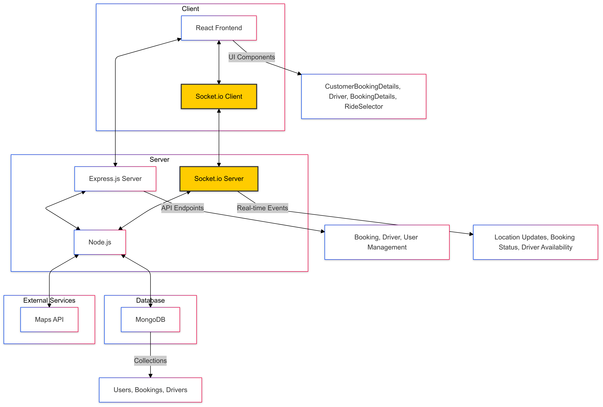
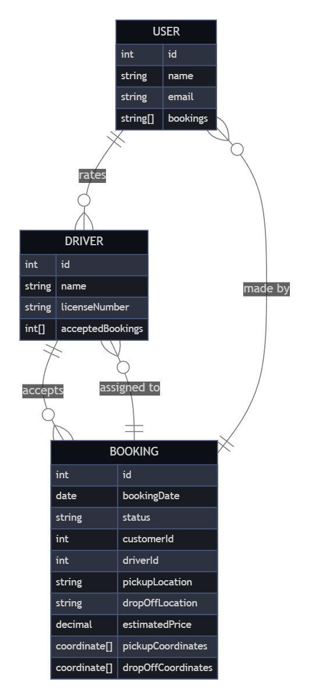

# Orim Logistics

This repository contains a full-stack application with a React Vite frontend and a Node.js backend. The project is organized into two main directories:

- `logsui`: Frontend built using React and Vite.
- `server`: Backend built using Node.js and Express.

## Project Structure

- **Frontend**: Located in the `logsui` folder. It uses React with Vite for fast development and performance.
- **Backend**: The `server` folder contains the Node.js and Express setup for handling API requests and business logic.

### Architecture Overview

The overall architecture of the project is designed to follow a client-server model. Here's a high-level overview:



### ER Diagram

The application uses a relational database, and the entity relationships are represented in the following ER diagram:



## Setup Instructions

### Prerequisites

Before running the project locally, make sure you have the following installed:

- **Node.js**: You can download and install it from [here](https://nodejs.org/).
- **MongoDB**.
- **Git**

### Cloning the Repository

1. Open your terminal and clone the repository:
   ```bash
   git clone https://github.com/Taherpatrawala/orim-logistics.git
   ```

### Run the Backend

2. Navigate to the `server` folder:
   ```bash
   cd server
   ```
   ```bash
   npm install
   ```
   ```bash
   npm start 5001
   ```

### Run the Frontend

3. Navigate to the `logsui` folder:

   ```bash
   cd logsui
   ```

   ```bash
   npm install
   ```

   ```bash
   npm run dev
   ```

### Use the Admin Dashboard

4. Navigate to the admin dashboard:

   ```bash
   http://localhost:5001/admin
   ```

   ```bash
   email: admin@admin.com (provided in the .env, .env is intentionally been kept for easier setup)
   password: 12345678
   ```

### Architecture Design Choices

1. **React with Vite (Frontend)**: Chosen for its fast bundling and lightweight development experience. Vite offers superior development speed compared to Webpack, making the frontend more responsive during development.

2. **Node.js with Express (Backend)**: Opted for its asynchronous, non-blocking nature, which allows handling numerous requests efficiently, crucial for real-time communication.

3. **MongoDB (Database)**: Chosen for its flexibility with unstructured data. Since the project involves dynamic, scalable data, MongoDB’s schema-less structure offers better adaptability compared to traditional relational databases like MySQL.

4. **AdminJS**: Integrated to provide a quick and intuitive interface for managing admin panel operations without custom coding. It helps in reducing development time for backend admin interfaces.

5. **Socket.IO**: Utilized for real-time, bi-directional communication between client and server, essential for live driver tracking and location updates in the application.

6. **Tailwind CSS**: Selected for its utility-first approach, which speeds up the design process by allowing easy and responsive styling directly in the JSX files.

7. **Leaflet with Routing Machine**: Used for mapping and live tracking functionalities, providing an open-source and customizable alternative to Google Maps API.
